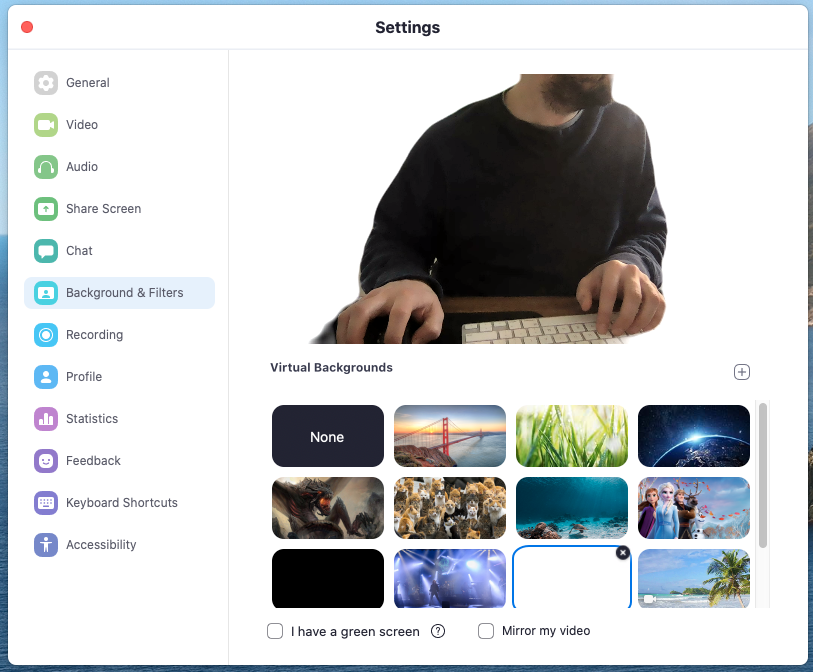

# Zoom Setting Recommendations 

This guide is here to offer assistance dealing with the many settings of Zoom. Through using Zoom, we have made a few changes to the default settings; Here is that list. 

# Getting to the Settings

To get to your general settings, click on the small gear located at the top right of your Zoom home screen. 

 

Once you have opened up the settings menu, we will find the general settings. 

## General Settings

 

The items that we have changed from default are the following. 

- Use dual Monitors (On)
- Show my meeting duration (On)
- Stop my video and audio when my display is off, or screen saver begins (On)
- Remind me "x" minutes before my upcoming meetings (On)

## Video Settings 

 

Changes from default

- Enable HD (On)
- Touch up my appearance (Because why not?!) (On)
- Always display participant name on their videos (On) 
- Turn off my video when joining a meeting (On)
- Spotlight my video when speaking (On)
- display up to 49 participants per screen in Gallery View (On)

## Audio Settings

 

Changes from default.

- Automatically join computer audio when joining a meeting (On)
- Mute my mic when joining a meeting (On)

## Screen Share 

 

Changes from default.

- Enter full screen when participant shares screen (Off)

## Chat

 

This section is deceptive because Zoom chat has nothing to do with the chat that is happening within the meeting.  To find the Zoom chat, you have to access it from the home screen.  We made some changes during our initial exploration but have never used the chat feature within Zoom since. 

- Show voice message button (On)
- Show code snipped button (On)

## Background and Filters

 

We have made no changes other than selecting the virtual background of your choice.  The University has recently released a helpful tool for creating a custom background. It can be found [here.](https://appcenter.chicagobooth.edu/PublicApps/ZoomNames/)

## Recording 

Changes from default. 

- Choose a location to save the recording to after the meetings ends (On)
- Add a timestamp to the recording (On)
- Place video next to the shared screen in the recording (On) 
- Keep temporary recording files (On)

# Web-based settings 

To access your web settings, you must click on the "View More Settings" link within the general settings tab.

Once you have logged, start by clicking on the settings tab located on the left side navigation bar. 

# Meeting (Security)

We have no changes from the default. 

# Meeting (Schedule Meeting)

Again no changes.

# Meeting (In Meeting (Basic))

Changes from default 

- Prevent participants from saving chat (Off)
- File Transfer (On)
- Display end-of-meeting experiences feedback survey(Off)
- Polling (On)
- Always show meeting control toolbar (On)
- Show Xoom windows during screen Share (On)
- Screen Sharing (On)
    - All Participants (On) 
- Allow Participants to rename themselves (On)

# Meeting (In Meeting (Advanced))

Changes from default

- Remote Support (On)
- Closed Captioning (On)
- Video Filters (Off)
- Only show default email when sending email invites (On)

Meeting (Email Notification)

Changes from default. 

- When a cloud recording is available (On)

# Other 

Changes from default. 

- Blur snapshot on iOS task switcher (On)

# Recordings

No changes to recordings. 

# Telephone 

No changes to Telephone. 

